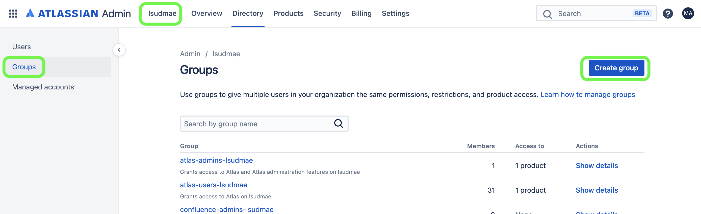
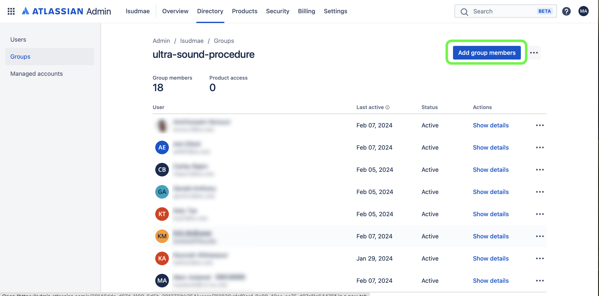
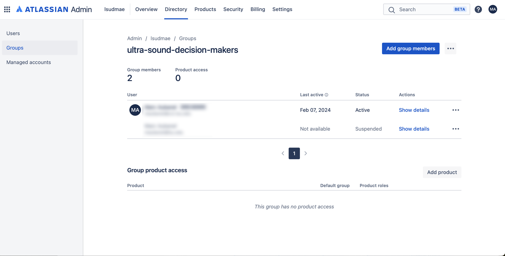

### Groups

[previous](../workflows/README.md#user-content-workflows) • [home](../README.md#user-content-jira-software) • [next](../)

Adding a set of users to a Group to make for easier permissions.

 

---

##### `Step 1.`\|`JIRASOFT`| :small_blue_diamond:

Go to [Site Administration](https://admin.atlassian.com/) and make sure you are in Jira team **lsudmae**. Now select the **Groups** tab and press the <kbd>Create Groups</kbd> button.

##### `Step 2.`\|`JIRASOFT`| :small_blue_diamond: :small_blue_diamond: 

Now you can press the <kbd>Add Group Members</kbd> where you have access to our entire Users pool.  In this case I am making one group for the entire team that will access the Jira project.

##### `Step 3.`\|`JIRASOFT`| :small_blue_diamond: :small_blue_diamond: :small_blue_diamond:

Adding another group called **decision-makers**.  This will be used to limit who can move tasks from **Review** to **Done**.

<!--  -->

| [previous](../workflows/README.md#user-content-workflows)| [home](../README.md#user-content-jira-software) | [next](../)|
|---|---|---|
