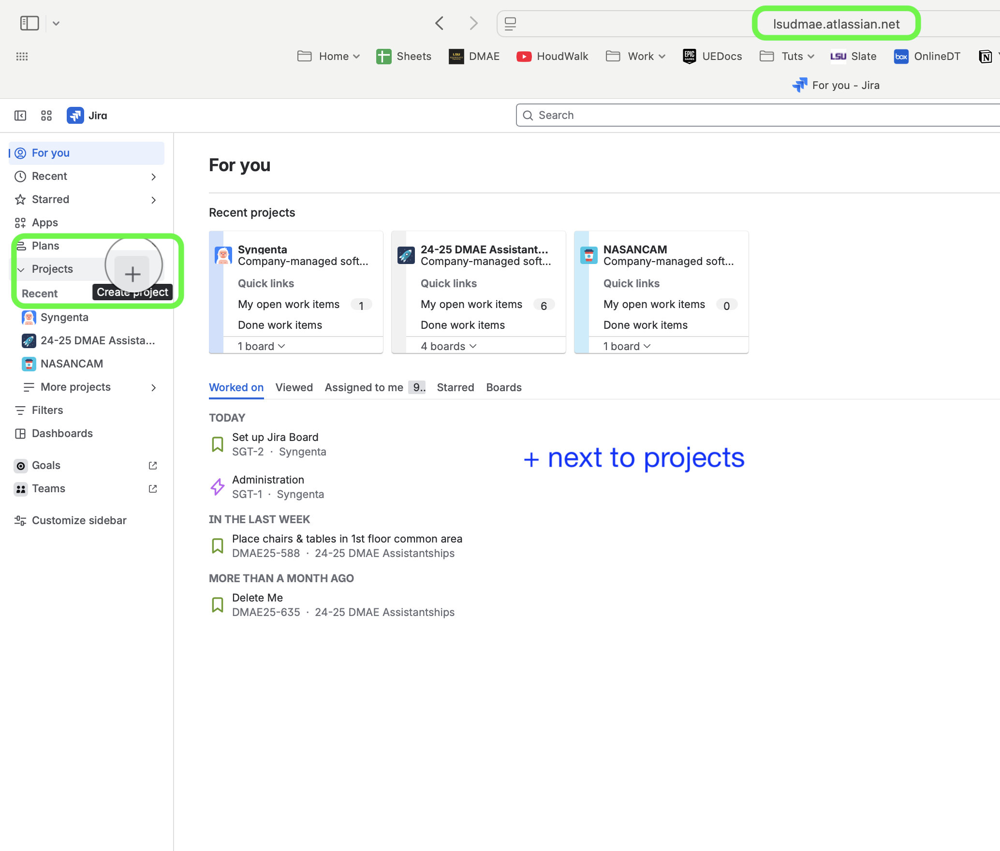
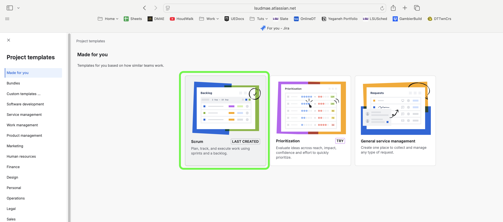
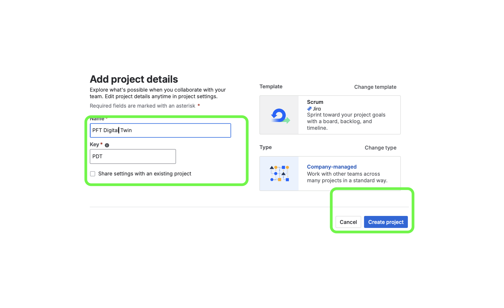

### Create New Project

[home](../README.md#user-content-jira-software) • [next](../workflows/README.md#user-content-custom-workflows)

Creating a new project from scratch in Jira.

 

---

##### `Step 1.`\|`JIRASOFT`| :small_blue_diamond:

Create a new project by going to [lsudmae.atlassian.net](https://lsudmae.atlassian.net) and logging in.  Select the **Projects** drop down menu and select <kbd>New Project</kbd>.
 

##### `Step 2.`\|`JIRASOFT`| :small_blue_diamond: :small_blue_diamond: 

Now most of the time we will be using the **Software Development | Scrum** Template that they give us.  We will use the default one to start.

##### `Step 3.`\|`JIRASOFT`| :small_blue_diamond: :small_blue_diamond: :small_blue_diamond:

Press <kbd>Use Template</kbd> to leave it as is.

##### `Step 4.`\|`JIRASOFT`| :small_blue_diamond: :small_blue_diamond: :small_blue_diamond: :small_blue_diamond:

Now add **Name** for the project and make sure you are happy with the **Key** as it will be used on every issue.  If you have a project setting from a prior project you want to copy you can do so by selecting **Share settings with an existing project**. 

##### `Step 5.`\|`JIRASOFT`| :small_orange_diamond:

Now your project is ready to go!

<!--  -->

[home](../README.md#user-content-jira-software) | [next](../workflows/README.md#user-content-custom-workflows)|
|---|---|
