### Project Settings

[previous](../new-project/README.md#user-content-create-new-project) • [home](../README.md#user-content-jira-software) • [next](../workflow/README.md#user-content-groups)

Customizing project with classroom tested workflows.

 

---

##### `Step 1.`\|`JIRASOFT`| :small_blue_diamond:

After you create the project it goes to project settings (or click on the three ellipses `...` next to your project and select `Project Settings`). Select `Category` and `Project Lead.`

##### `Step 2.`\|`JIRASOFT`| :small_blue_diamond: :small_blue_diamond: 

Nothing to edit in Summary, summarizes all the settings.

##### `Step 3.`\|`JIRASOFT`| :small_blue_diamond: :small_blue_diamond: :small_blue_diamond:

In the **People** tab add your `Developers` and `Admins`.

##### `Step 4.`\|`JIRASOFT`| :small_blue_diamond: :small_blue_diamond: :small_blue_diamond: :small_blue_diamond:

Permissions

Double check your permission settings to ensure that the administrators and developers have the permissions you want.

##### `Step 5.`\|`JIRASOFT`| :small_orange_diamond:

Select the `Workflows` tab and then `Edit Workflow`. 

##### `Step 6.`\|`JIRASOFT`| :small_orange_diamond: :small_blue_diamond:

Press `Update Workflow`.

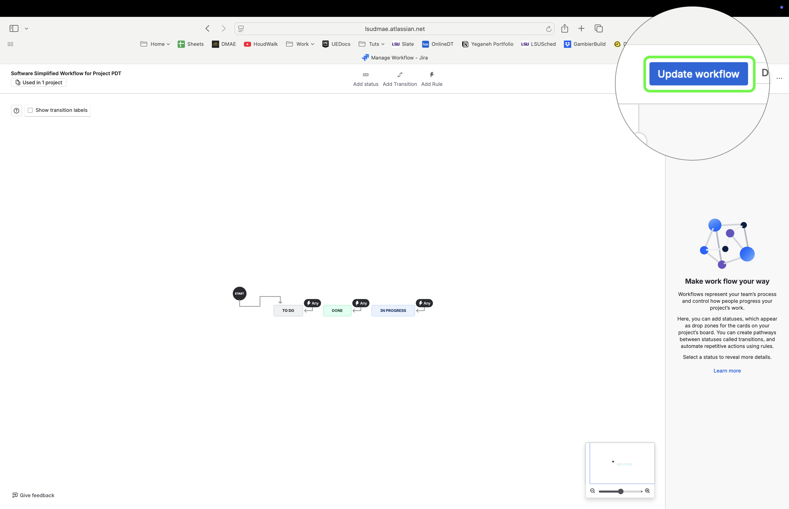

##### `Step 7.`\|`JIRASOFT`| :small_orange_diamond: :small_blue_diamond: :small_blue_diamond:

Switch scheme to the `DMAE25: Software Simplified Workflow Scheme`

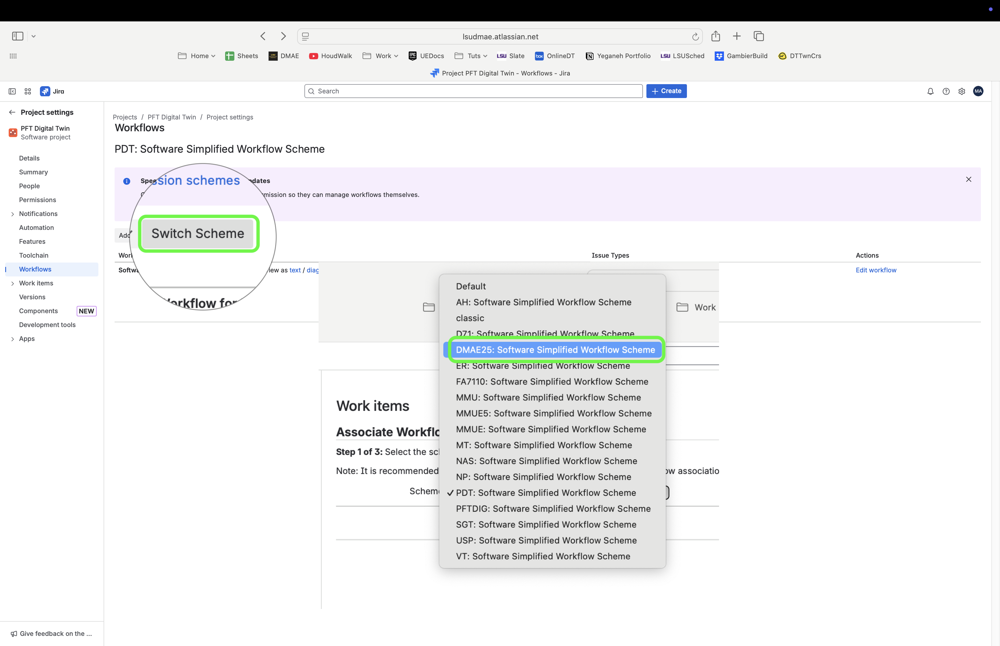

##### `Step 8.`\|`JIRASOFT`| :small_orange_diamond: :small_blue_diamond: :small_blue_diamond: :small_blue_diamond:

Press the `Associate` button in the next two screens.

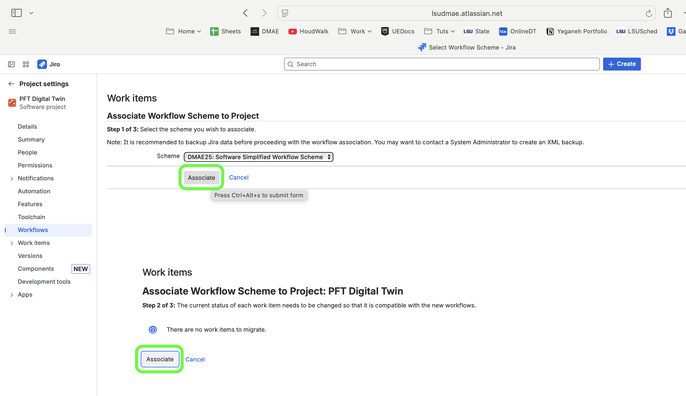

##### `Step 9.`\|`JIRASOFT`| :small_orange_diamond: :small_blue_diamond: :small_blue_diamond: :small_blue_diamond: :small_blue_diamond:

Now you should have an updated workflow that add blocked and review to the flow

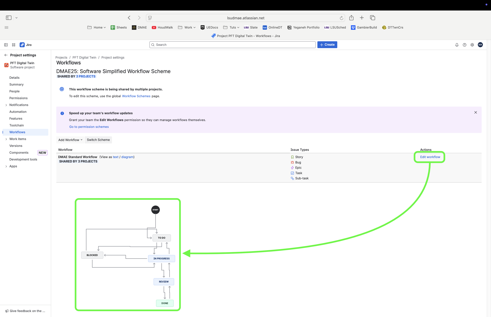

##### `Step 10.`\|`JIRASOFT`| :large_blue_diamond:

Now only a group of people can drag a work item from `Review` to `Done`.  This is limited to only members of the `jira-done-deciders` group. So you you will have to add all the users in your project that you want to give permission to move from Review to Done in that group.

Please note that anyone can move an item from `Done` back to `Review` and work on the item again.

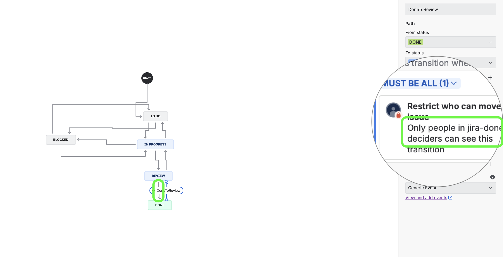

##### `Step 11.`\|`JIRASOFT`| :large_blue_diamond: :small_blue_diamond:

Select the right hand most gear and choose `User Management` then `Add group members` for all people you want to have the ability to approve work.  

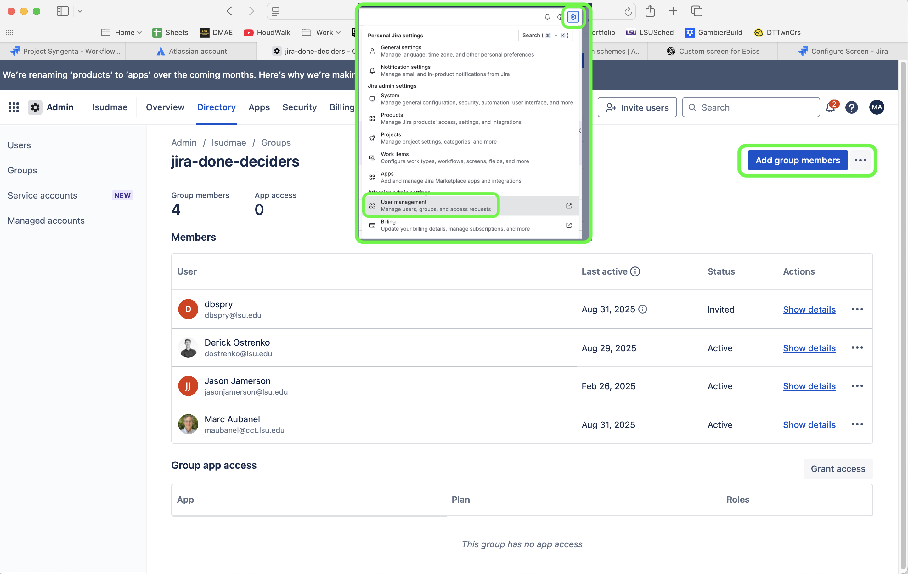

##### `Step 12.`\|`JIRASOFT`| :large_blue_diamond: :small_blue_diamond: :small_blue_diamond:

Go to your project board and click on the 3 dot ellipses `...` and select `Board Settings`.

In the `Details` tab check that your administrators are correct.

In the `Working Days` check all days that your team is expected to work on (I typically leave it Monday to Friday) and add any holidays that you see fit.

Go to the `Estimation Tab` and change it from `Story Points` to `Original time estimate`.

In `Layout | Columns` you need to add the two new workflows added by pressing the `+` button and adding a `Review` and `Blocked` column and drag the two status with the same name into the column.

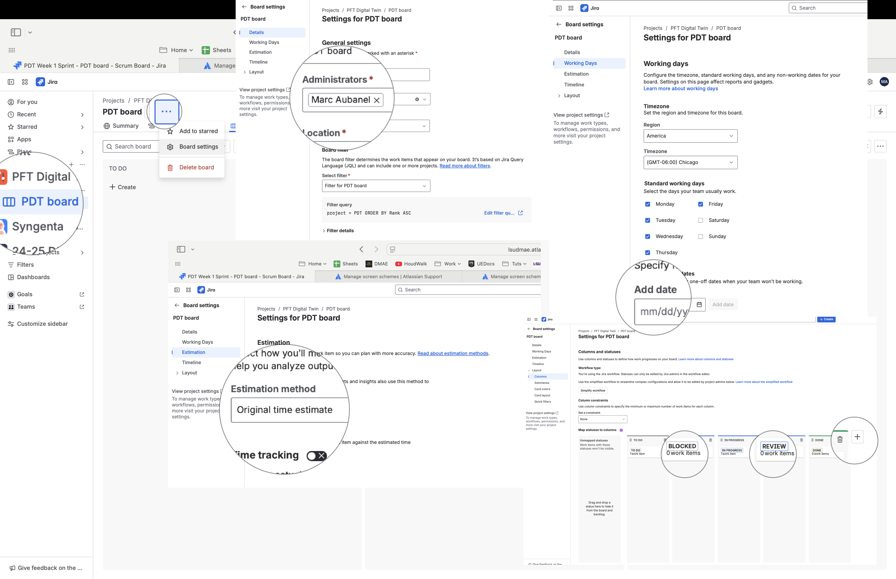

##### `Step 13.`\|`JIRASOFT`| :large_blue_diamond: :small_blue_diamond: :small_blue_diamond:  :small_blue_diamond:

Now if we go back to `Project Settings` you will see that there are 5 types.  I typically don't use Tasks (the difference between a Story and a Task is a bit moot in my mind).  Also, I find the layout for subtasks to be confusing so use epics and stories (epics are larger than one week tasks and stories need to fit within a sprint).

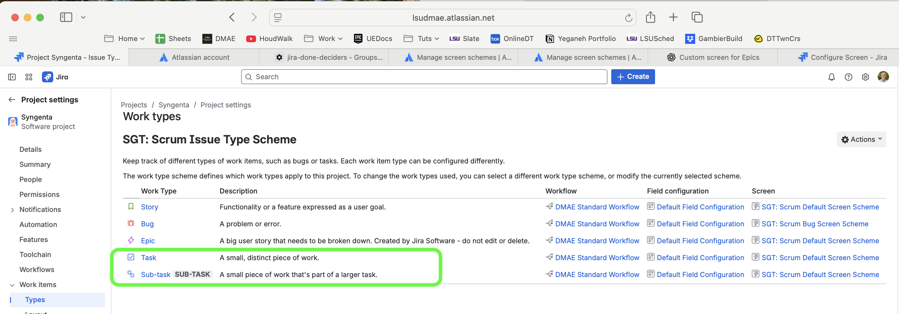

##### `Step 14.`\|`JIRASOFT`| :large_blue_diamond: :small_blue_diamond: :small_blue_diamond: :small_blue_diamond:  :small_blue_diamond:

To remove them go to the site settings on the top right wheel and select `Work items` then click on the `Issue Type Scheme` of the project you are working on.  This project `Syngenta` with key `SGA` is the one I will edit.

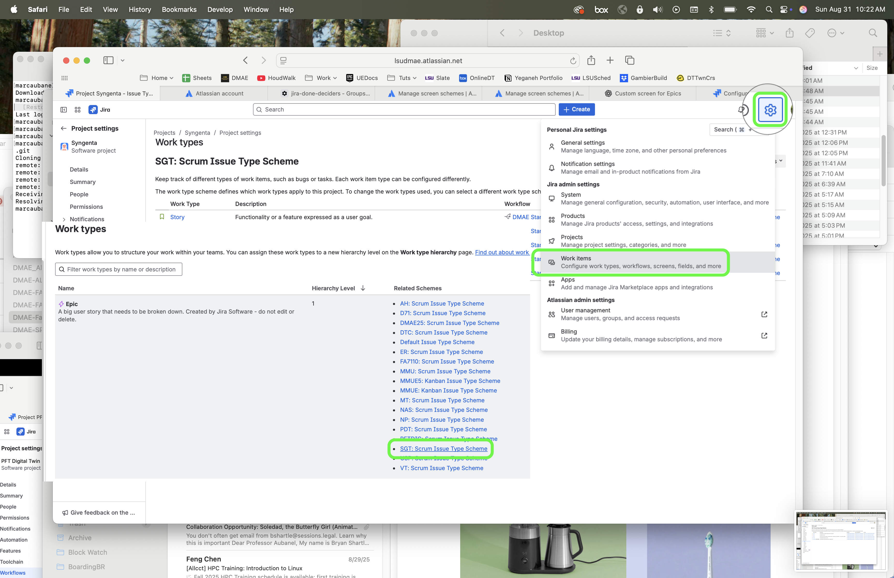

##### `Step 15.`\|`JIRASOFT`| :large_blue_diamond: :small_orange_diamond:

I select the three ellipse `...` and `Edit` the scheme.  I then drag `Task` `Sub Task` to the Available types, removing them from just this project.

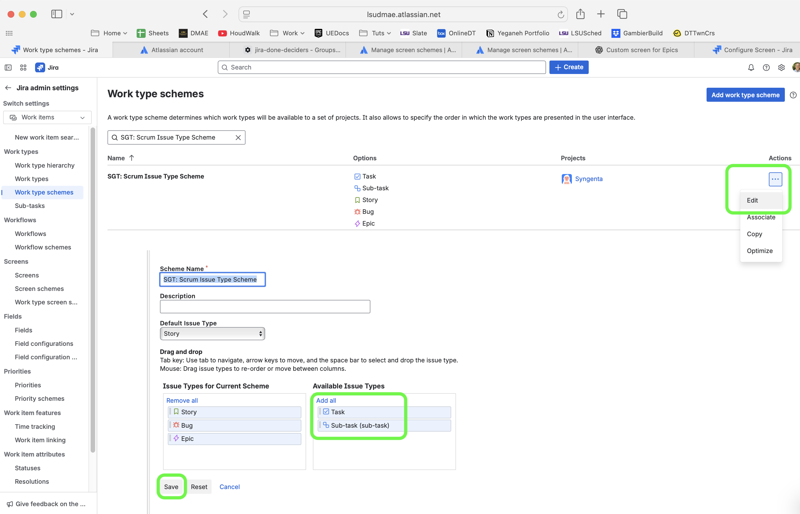

##### `Step 16.`\|`JIRASOFT`| :large_blue_diamond: :small_orange_diamond:   :small_blue_diamond:

Now if you go back to the `Project Settings` and look at `Work items | Types` you will swee that we are down to our three desired bug types.

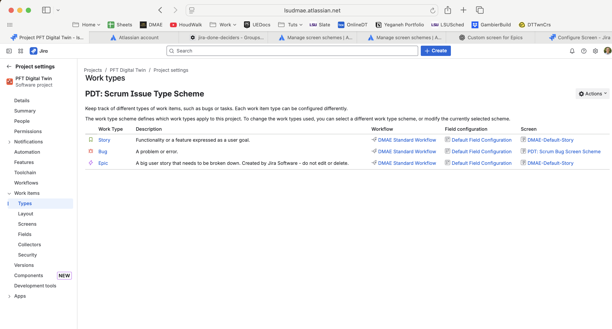

> ## ✅ Next Up – Workflow

| [previous](../new-project/README.md#user-content-create-new-project)| [home](../README.md#user-content-jira-software) | [next](../workflow/README.md#user-content-workdlow) |
|---------------------------|---|-----------------------------------------------------|
