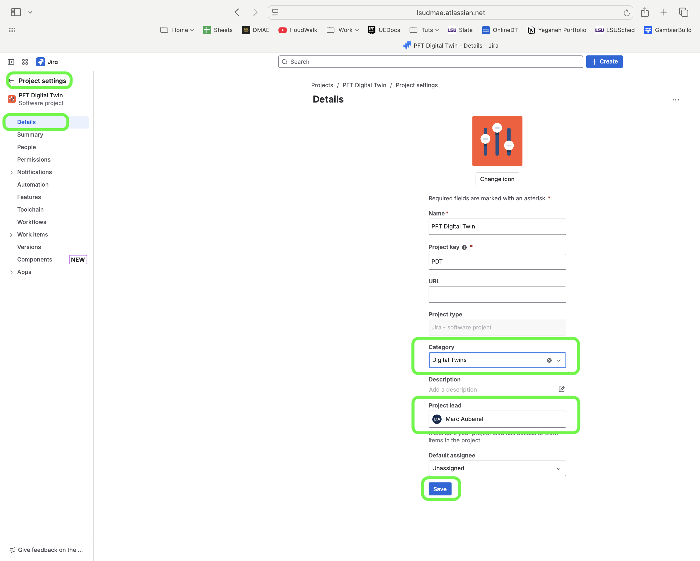
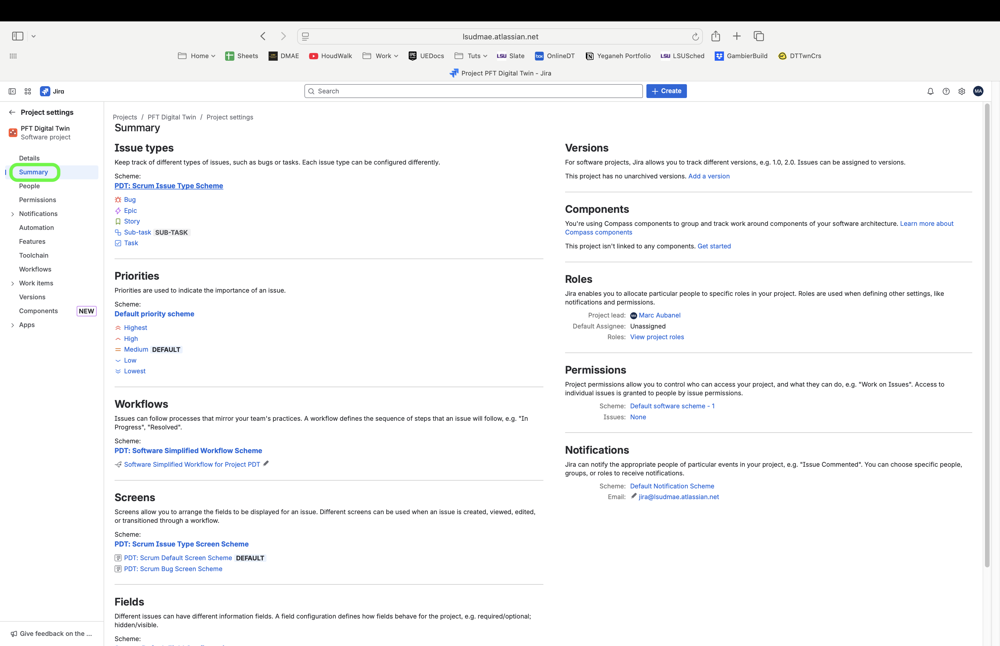
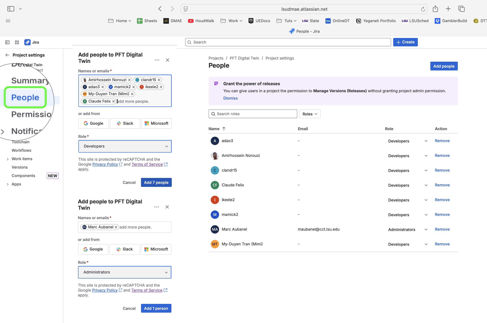
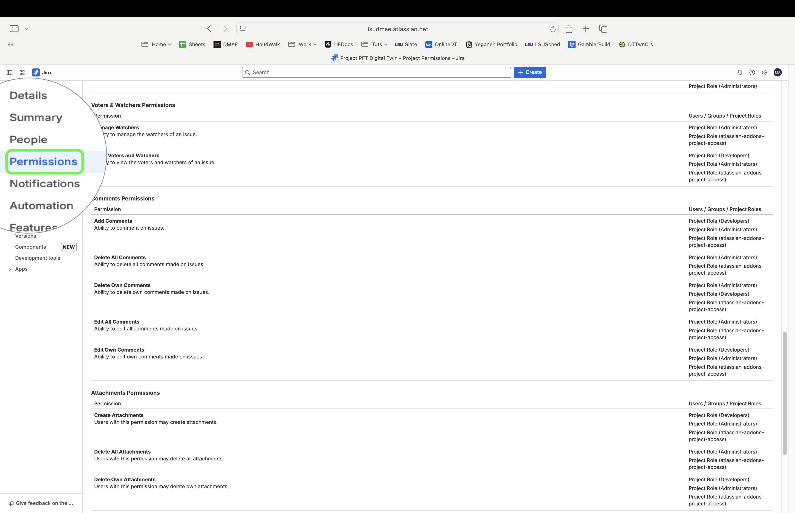
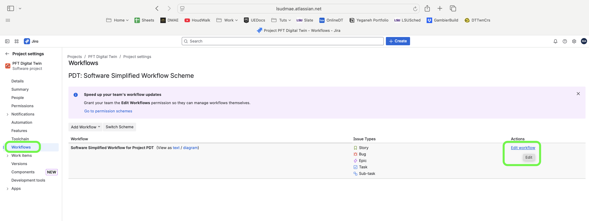
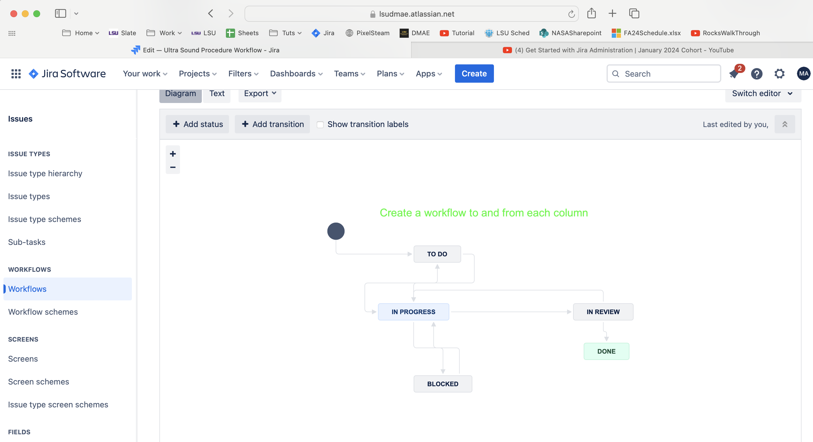
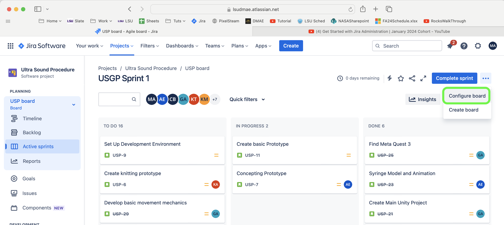
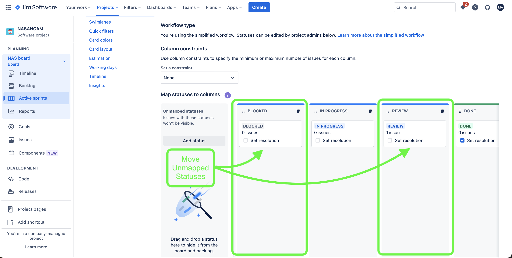
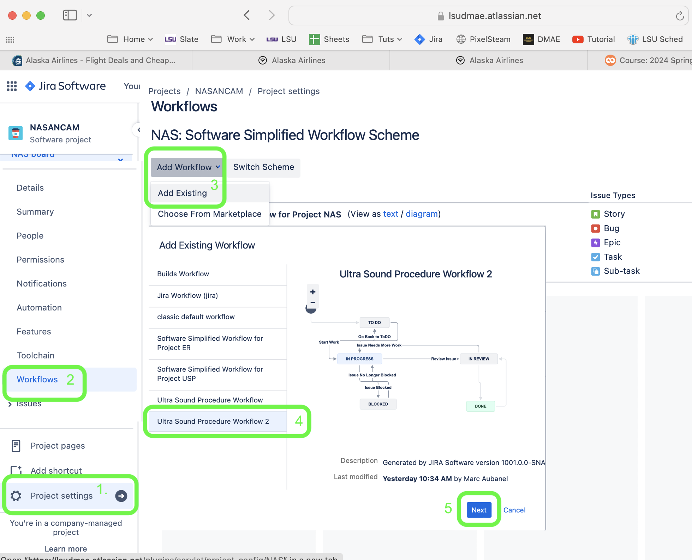
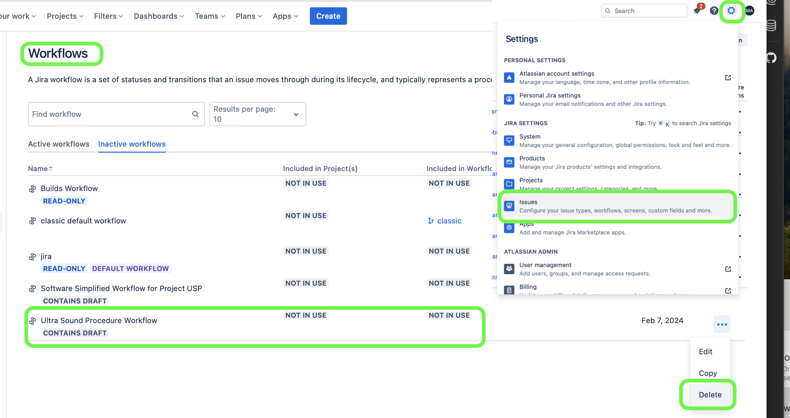

### Project Settings

[previous](../new-project/README.md#user-content-create-new-project) • [home](../README.md#user-content-jira-software) • [next](../groups/README.md#user-content-groups)

Customizing project with classroom tested workflows.

 

---

##### `Step 1.`\|`JIRASOFT`| :small_blue_diamond:

After you create the project it goes to project settings (or click on the three ellipses `...` next to your project and select `Project Settings`). Select `Category` and `Project Lead.`

##### `Step 2.`\|`JIRASOFT`| :small_blue_diamond: :small_blue_diamond: 

Nothing to edit in Summary, summarizes all the settings.

##### `Step 3.`\|`JIRASOFT`| :small_blue_diamond: :small_blue_diamond: :small_blue_diamond:

In the **People** tab add your `Developers` and `Admins`.

##### `Step 4.`\|`JIRASOFT`| :small_blue_diamond: :small_blue_diamond: :small_blue_diamond: :small_blue_diamond:

Permissions

Double check your permission settings to ensure that the administrators and developers have the permissions you want.

##### `Step 5.`\|`JIRASOFT`| :small_orange_diamond:

Select the `Workflows` tab and then `Edit Workflow`. 

##### `Step 6.`\|`JIRASOFT`| :small_orange_diamond: :small_blue_diamond:

Add and remove any statuses. Try not to keep the **all** flows that are default and limit movement between columns as well as permissions of who can move a task to **Done**. Remember to give permission to both directions (which nodes can go forward and which can go back).

Now we need to add the extra lanes that match the workflow.  Be careful that you need to all the workflow nodes in an active column.  In the top right select <kbd>...</kbd> **Configure Board** on thte top right of the active project page in the **Active Sprint**.

Add the new columns for each new node you created.  Then drag the unmapped statuses to the new empty columns.  Move them into a logical order that matches your above workflow.

In the project press **Project Settings** and select <kbd>Add Workflows | Add Existing</kbd>.  Select the workflow you were editing then press <kbd>Next</kbd>.  Follow the next steps and make sure you press <kbd>Publish</kbd> at the end!

##### `Step 7.`\|`JIRASOFT`| :small_orange_diamond: :small_blue_diamond: :small_blue_diamond:

Now so we don't want to get too many workflows so we need to go to the overall **Settings** in the top right corner and select **Issues**.  Then select the **Workflows** tab and click on the three dots <kbd>...</kbd> and select **Delete**.

<!--  -->

| [previous](../new-project/README.md#user-content-create-new-project)| [home](../README.md#user-content-jira-software) | [next](../groups/README.md#user-content-groups)|
|---------------------------|---|---|
