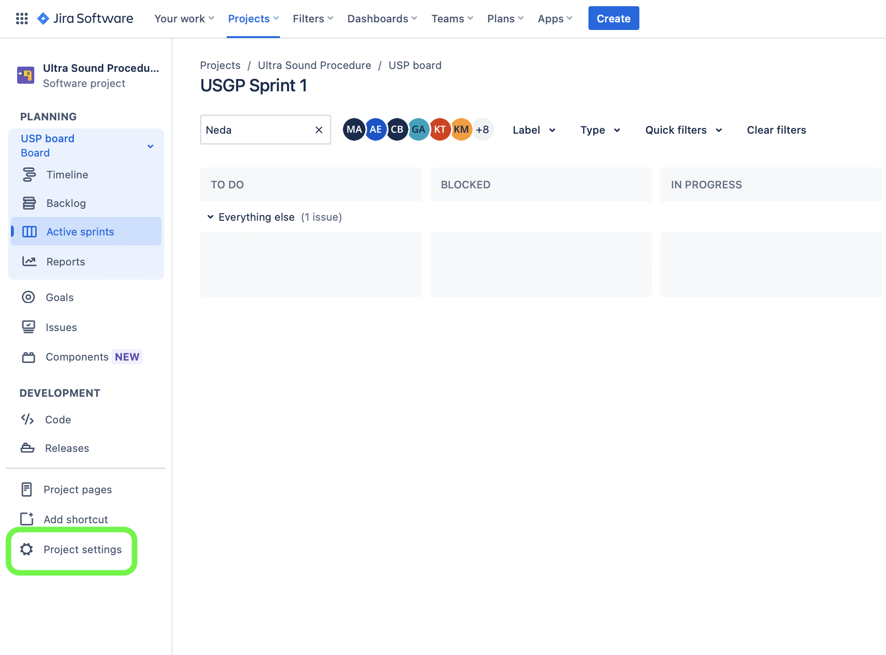
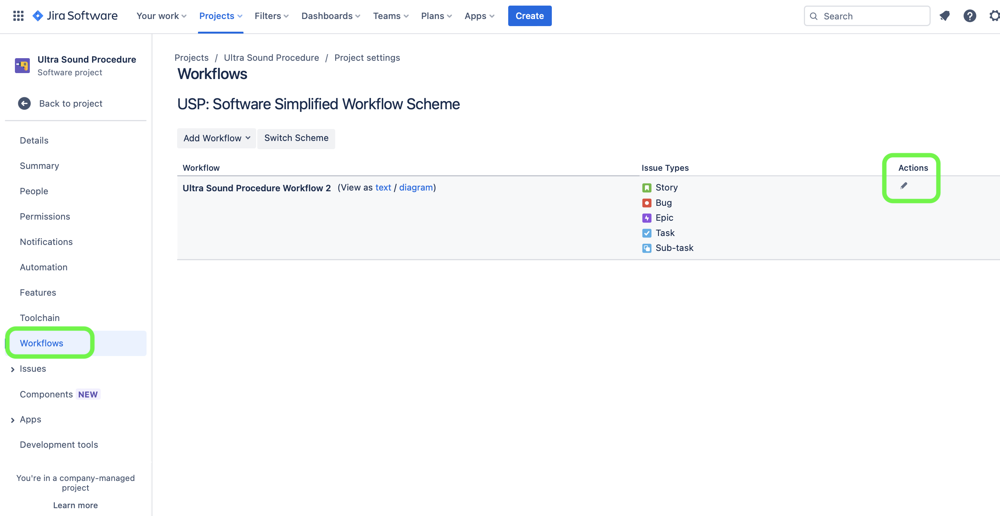
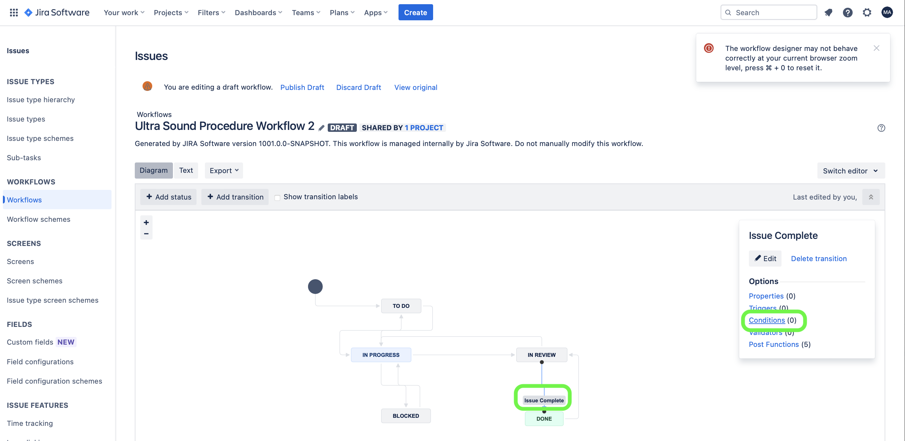
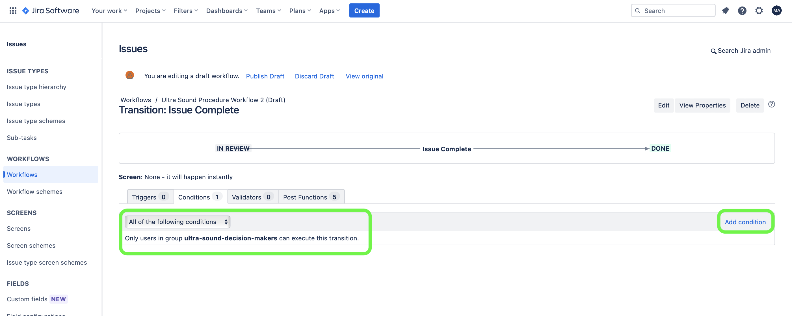
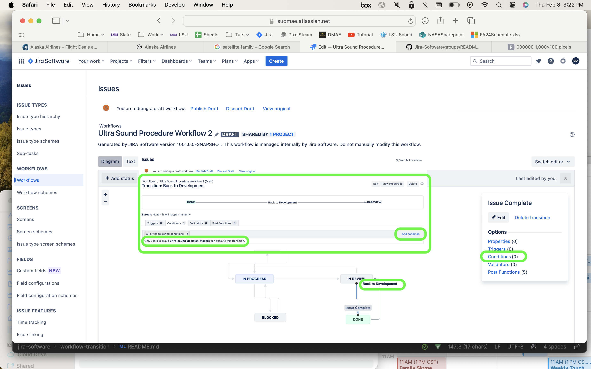

### Restrict Workflow Transition

[previous](../) • [home](../README.md#user-content-jira-software) • [next](../)

Create rules to restrict users from moving an issue from one workflow column to the next in the sprint board.

 

---

##### `Step 1.`\|`JIRASOFT`| :small_blue_diamond:

To make a change to your workflow first try to see if you can make the change to the active workflow as you are not adding or removing processes.  Press the <kbd>Project settings</kbd>.

##### `Step 2.`\|`JIRASOFT`| :small_blue_diamond: :small_blue_diamond: 

Press the <kbd>Workflow</kbd> tab and then press the <kbd>Pencil</kbd> icon to edit the workflow.

##### `Step 3.`\|`JIRASOFT`| :small_blue_diamond: :small_blue_diamond: :small_blue_diamond:

You click on the transition you want to change.  In this case I want to restrict whom can move a task from **Review** to **Done**. Press the **Condition** link to add a condition for this transition.

##### `Step 4.`\|`JIRASOFT`| :small_blue_diamond: :small_blue_diamond: :small_blue_diamond: :small_blue_diamond:

Press the **Add Condition** link and add a condition based on a user being in a group - but you can pick from any of the other conditions.

##### `Step 5.`\|`JIRASOFT`| :small_orange_diamond:

I also added a way back to bring a task from **Done** back into **Review** if an issue needs to be readressed (like a fixed bug coming back).

<!--  -->

| [previous](../)| [home](../README.md#user-content-jira-software) | [next](../)|
|---|---|---|
