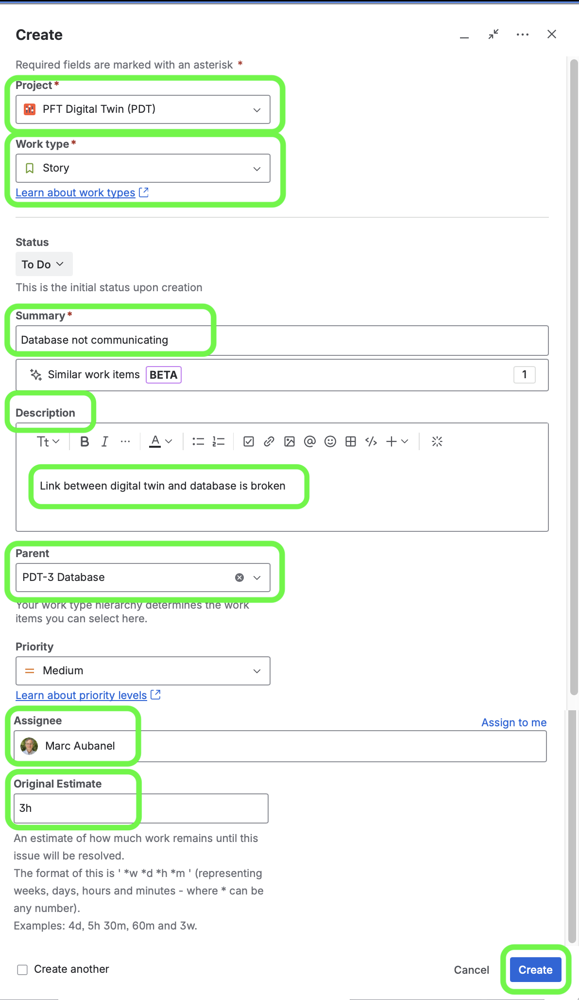

### Groups

[previous](../project-settings/README.md#user-content-workflows) • [home](../README.md#user-content-jira-software) • [next](../)

Adding a set of users to a Group to make for easier permissions.

 

---

##### `Step 1.`\|`JIRASOFT`| :small_blue_diamond:

Every task has to have a parent **Epic** task.  Epics are used to determine what area that work is going into.  It could be a:

 * Type of task like **Administration**, **Documentation**, **Programming** etc...
 * If there is a **feature** that takes longer than a week you are working on (could involve multiple disciplines), then use this intead of the task like **Implement start button**, **Add jumping to pawn** etc...

Press the <button>+ Create</button> button and select the **Project**, set **Work Type** to `Epic` add a **Summary** and **Description** and leave the **Parent**, **Assignee** and **Original Estimate** blank.  Since Epics are supposed to last longer than one sprint and in some cases the entire project they do not need an estimate.

##### `Step 2.`\|`JIRASOFT`| :small_blue_diamond: :small_blue_diamond: 

Once you have the **Epics** arranged it is time to enter your tasks, or User Stories.  This is a task that lasts at the longest one sprint.  If it takes longer, break it down into multiple tasks.  

All Stories should be measurable and testable.  If it is research, make sure the knowledge is transferred to the appropriate people on the team.

Add the **Project**, `Story` **Work type**, **Summary**, **Description**, **Parent**, **Priority** (if you are prioritizing tasks), **Assignee** and **Original Estimate** in hours.

<!--  -->

| [previous](../project-settings/README.md#user-content-workflows)| [home](../README.md#user-content-jira-software) | [next](../)|
|---|---|---|

