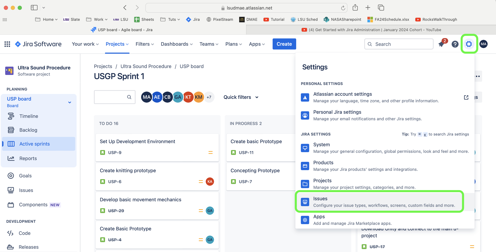
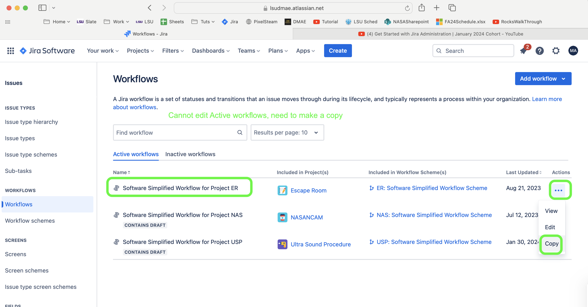
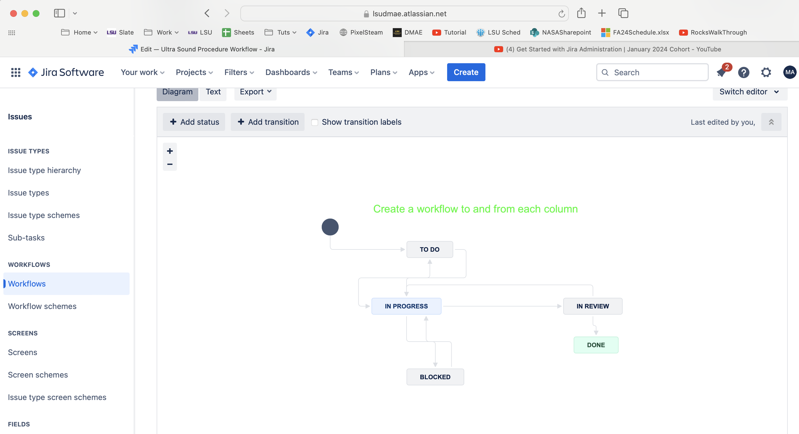
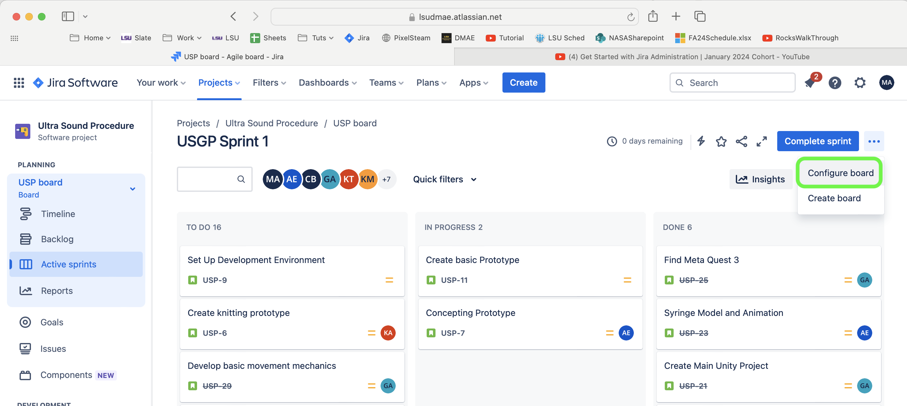
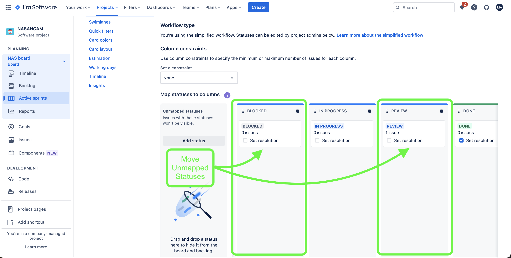
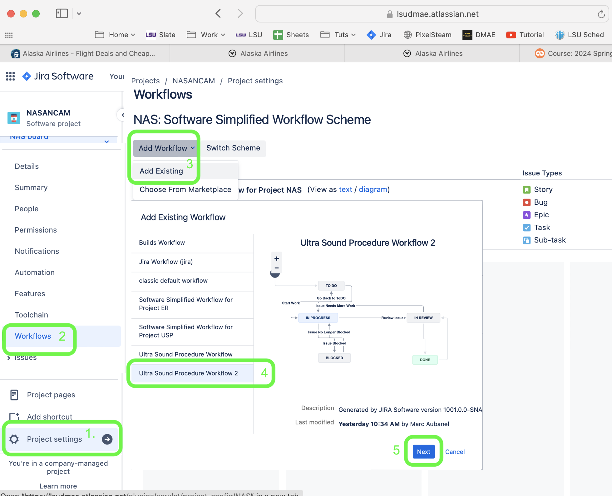
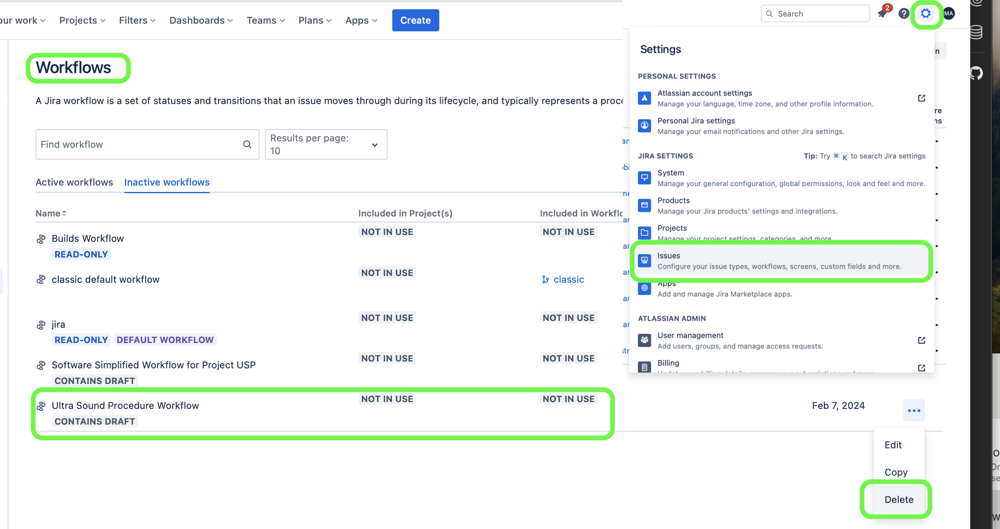

### Custom Workflows

[home](../README.md#user-content-jira-software) • [next](../groups/README.md#user-content-groups)

When you want to customize the columns and create custom workflows (who can move from one column to another). You need administration privileges to do the below operations.  

 

---

##### `Step 1.`\|`JIRASOFT`| :small_blue_diamond:

You cannot edit an active **Workflow**. The first thing we need to do is make a copy to then make changes.  *Press* the <kbd>Settings</kbd> gear in the top right hand side and select the **Issues** tab.

##### `Step 2.`\|`JIRASOFT`| :small_blue_diamond: :small_blue_diamond: 

Select the workspace you want to edit and make a copy of it.  Please remember to delete this workflow if it will no longer be used and becomes inactive.

##### `Step 3.`\|`JIRASOFT`| :small_blue_diamond: :small_blue_diamond: :small_blue_diamond:

Try not to keep the **all** flows that are default and limit movement between columns as well as permissions of who can move a task to **Done**.

##### `Step 4.`\|`JIRASOFT`| :small_blue_diamond: :small_blue_diamond: :small_blue_diamond: :small_blue_diamond:

Now we need to add the extra lanes that match the workflow.  Be careful that you need to all the workflow nodes in an active column.  In the top right select <kbd>...</kbd> **Configure Board** on thte top right of the active project page in the **Active Sprint**.

##### `Step 5.`\|`JIRASOFT`| :small_orange_diamond:

Add the new columns for each new node you created.  Then drag the unmapped statuses to the new empty columns.  Move them into a logical order that matches your above workflow. 

##### `Step 6.`\|`JIRASOFT`| :small_orange_diamond: :small_blue_diamond:

In the project press **Project Settings** and select <kbd>Add Workflows | Add Existing</kbd>.  Select the workflow you were editing then press <kbd>Next</kbd>.  Follow the next steps and make sure you press <kbd>Publish</kbd> at the end!

##### `Step 7.`\|`JIRASOFT`| :small_orange_diamond: :small_blue_diamond: :small_blue_diamond:

Now so we don't want to get too many workflows so we need to go to the overall **Settings** in the top right corner and select **Issues**.  Then select the **Workflows** tab and click on the three dots <kbd>...</kbd> and select **Delete**.

<!--  -->

| [home](../README.md#user-content-jira-software) | [next](../groups/README.md#user-content-groups)|
|---------------------------|---|
